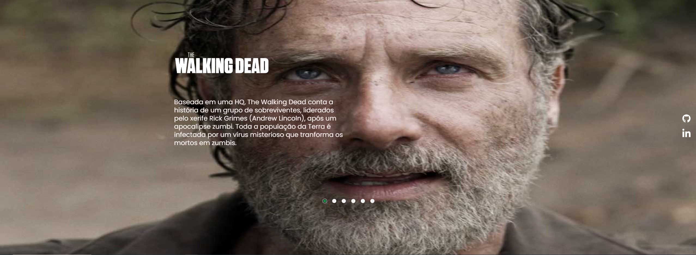
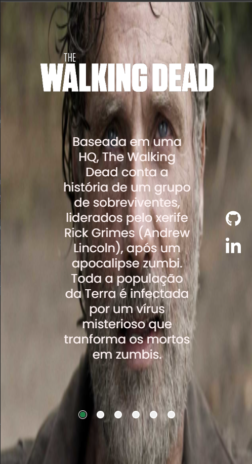

# Projeto Carrossel The Walking Dead

<<<<<<< HEAD
Um projeto carrossel, foi usado Tags Semânticas do HTML e propriedades avançadas do CSS com JavaScript que a funcionalidade é que a cada click no botão aparecesse outra imagem da série.
=======
## Desafio 
Desafio foi fazer um carrossel de funcionalidade pra que cada click no botão rodasse outra imagem
>>>>>>> 852a4c263a6fbbc29cf456e148aa332e9da5662b

---

## Funcionalidade
[]

## Adaptado ao computador
[]

## Adatapado Mobile
[]

## Tecnologias utilizadas

- HTML
- CSS
- JavaScript
<<<<<<< HEAD
- Git
- VSCode
=======
>>>>>>> 852a4c263a6fbbc29cf456e148aa332e9da5662b
